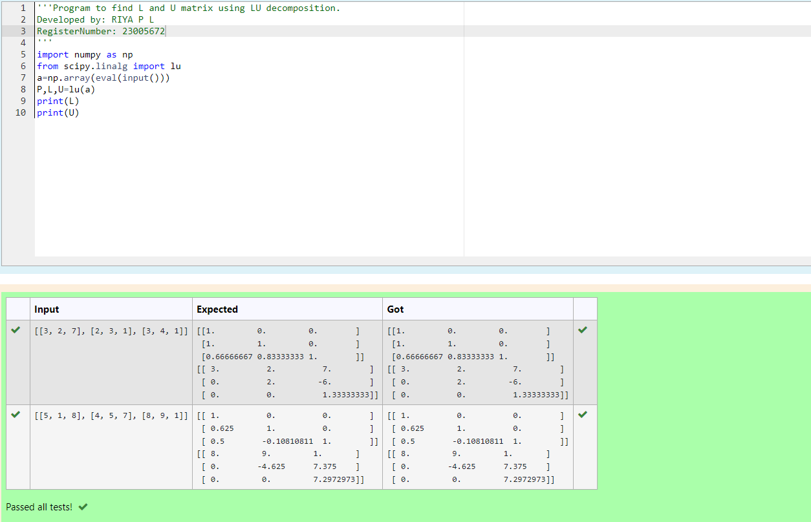
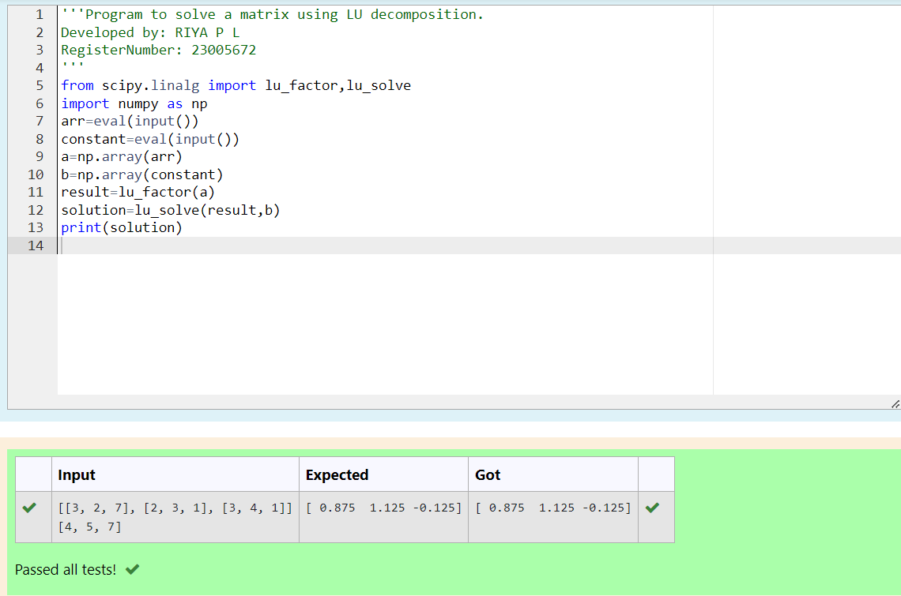

# LU Decomposition 

## AIM:
To write a program to find the LU Decomposition of a matrix.

## Equipments Required:
1. Hardware – PCs
2. Anaconda – Python 3.7 Installation / Moodle-Code Runner

## Algorithm
1. Import libraries import numpy as np
2. Get input matrix from user
3. Find L and u decomposition
4. Print L and U

## Program:
(i) To find the L and U matrix
```PYTHON
/*
Program to find the L and U matrix.
Developed by: RIYA P L
RegisterNumber: 23005672
*/
import numpy as np
from scipy.linalg import lu
a=np.array(eval(input()))
P,L,U=lu(a)
print(L)
print(U)
```
(ii) To find the LU Decomposition of a matrix
```PYTHON
/*
Program to find the LU Decomposition of a matrix.
Developed by: RIYA P L
RegisterNumber: 23005672
*/
from scipy.linalg import lu_factor,lu_solve
import numpy as np
arr=eval(input())
constant=eval(input())
a=np.array(arr)
b=np.array(constant)
result=lu_factor(a)
solution=lu_solve(result,b)
print(solution)

```

## Output:



## Result:
Thus the program to find the LU Decomposition of a matrix is written and verified using python programming.

